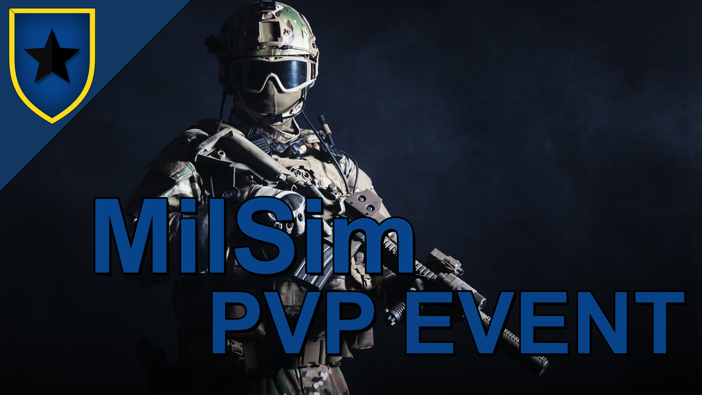

Unser erstes MilSim PVP Event steht an!
Das Ganze findet mit dem normalen MilSim Modpack statt.
  
Geplant ist ein Team Deathmatch in einem überschaubaren Gebäude Komplex.  
Beide Teams starten gegenüber voneinander und müssen sich dann gegenseitig bekämpfen, auch möglich ist, dass ein Team verteidigit und das andere von außerhalb angreift um ein Objekt oder Geisel zu sichern.  

### Details
- Beide Teams sind auf dem Teamspeak und kommunizieren über ACRE2, sind also auch für die Gegner hörbar, daher ist taktische Planung und eine gute Absprache sehr wichtig
- Gespielt wird mit allen gängigen Waffen die unser Modpack zu bieten hat
- Wirst du bewusstlos kannst du (wie bei normalen Einsätzen) von einem Teammitglied behandelt werden, es kostet aber Zeit und man ist wehrlos
- Wenn du stirbst, bist du für die Runde raus, das letzte Team, das lebt gewinnt

### Wann 
<b>17.06.23 - 20:00 Uhr</b>  

### Wo
<b>Auf unserem MilSim und TeamSpeak Server</b> 

### Warum ein PVP Event?
Die Idee hinter diesem Event ist, die Verbesserung von taktischem Vorgehen und Teamarbeit, sodass sich die dort gewonnenen Erfahrung in unsere regulären PVE Einsätze übertragen lassen.  
Des Weiteren können sich noch unerfahrene Spieler im Spiel ausprobieren und durch "alte Hasen" etwas dazu lernen.  
Außerdem ist es eine willkommene Abwechslung zu den KI-Gegnern.  

Bei Fragen, Ideen usw. könnt ihr mich gerne ansprechen.