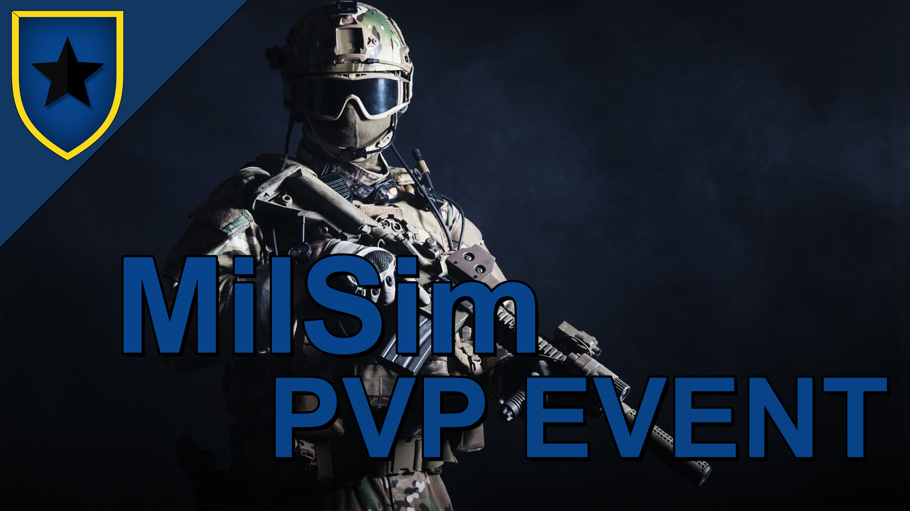

Da unser erstes PVP Event sehr gut ankam, möchten wir dieses Wochenende direkt unser zweites PVP Event veranstalten.
Das Ganze findet mit dem normalen MilSim Modpack statt.
  
Das Event wird ein spannendes Team Deathmatch in einem kompakten Gebäude Komplex sein. Die Teams werden sich entweder direkt bekriegen oder eine Angriff-Verteidigung Situation simulieren, bei der ein Team ein Objekt oder eine Geisel sichern muss.

### Details
- Keine Granatwerfer, Raketenwerfer oder Impact-Granaten
- Erlaubt sind alle gängigen Waffen aus unserem Modpack
- Wenn du bewusstlos wirst, kannst du von einem Teammitglied behandelt werden, aber das kostet Zeit und macht euch angreifbar
- Wenn du stirbst, bist du für die Runde ausgeschieden, das letzte Team, das überlebt, gewinnt

### Wann 
<b>24.06.23 - 20:00 Uhr</b>  

### Wo
<b>Auf unserem MilSim und TeamSpeak Server</b> 

Bei Fragen, Ideen usw. könnt ihr mich gerne ansprechen.