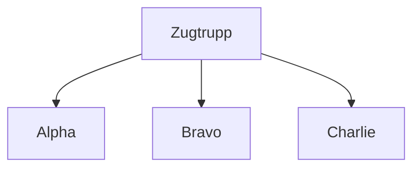
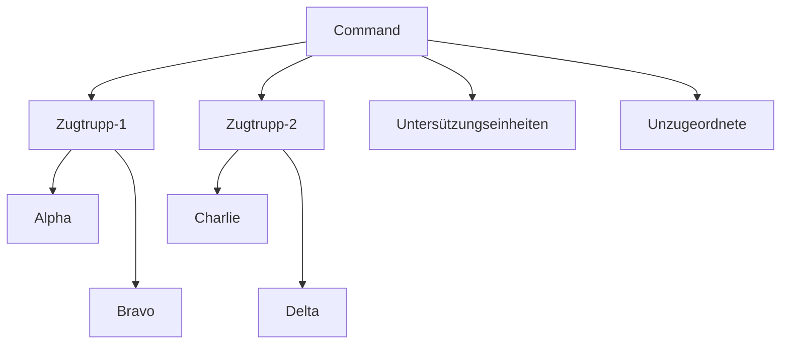

# 📒 Leitfaden / Handbuch

Hier findest du alle Notwendigen Vorgehenweisen, Vorgaben und Informationen die du kennen / können solltest.  

Obwohl wir versuchen so wenig wie möglich mit Regeln um uns zu werfen, sind ein paar trotzdem notwendig.  
Wir bitten darum, dass du dich an diese hältst, denn sie dienem einem ordentlichen Spielablauf und sollen den Spielspaß aufrecht erhalten. [Zur Dienstvorschrift](/milsim/dienstvorschrift)

## 🗃️ Organisation

Hier findest du alle Informationen zu jeder organisatorischen Einheit.

### Trupps

Ein Trupp besteht aus 3-4 Soldaten.  
Er setzt sich aus einem Truppführer, seinem Vertreter und zwei Soldaten zusammen.  

**Beispiel Trupp:**

<table>
  <thead>
    <tr>
      <th>Squad Alpha</th>
      <th>Position 1</th>
      <th>Position 2</th>
      <th>Position 3</th>
      <th>Position 4</th>
    </tr>
  </thead>
  <tbody>
    <tr>
      <td><b>Aufgabe</b></td>
      <td>Truppführer (TF)</td>
      <td>Ass. Truppführer (ATF)</td>
      <td>Schütze</td>
      <td>Sanitäter</td>
    </tr>
    <tr>
      <td><b>Rufzeichen</b></td>
      <td>Alpha-1</td>
      <td>Alpha-2</td>
      <td>Alpha-3</td>
      <td>Alpha-4</td>
    </tr>
  </tbody>
</table>

:::info
Position 2, 3 und 4 können auch Aufgaben wie MG-Schütze, AT-Schütze oder andere übernehmen.
:::

:::caution Hinweis
- Position 2 ist unabhängig von seiner Aufgabe (MG,AT ...) immer der assistierende Truppführer (ATF). 
- Sanitäter sind **immer** in der letzten Position zu zuornden.
:::

### Zugstruktur

Ein Zug setzt sich aus mehreren Trupps zusammen.  
In der Regel gibt es einen **Zugführer (ZF)** mit seinem **Zugtrupp (ZT)**. Der Zugtrupp koordiniert alle Trupps seines Zuges. 

### Gesamtstruktur

Der **Command** ist die oberste Instanz und ist jeder Einheit übergeordnet, dies gilt zu jeder Zeit. Der Command ist für die koordination des gesamten Verbandes zuständig.  
Die ZFs, sowie alle Untersützungstruppen und unzugeordnete Einheiten sind ihm direkt unterstellt, während TFs nur indirekt unterstellt sind.

## 🔥 Feuerstatus

>### 🟢 Grün
>Feuer auf **bestätigte** feindliche Einheiten darf nach eigenem Ermessen >eröffnet werden.

>### 🟡 Gelb
>Beschuss erwiedern

>### 🔴 Rot
>Feuer auf **bestätigte** feindliche Einheiten darf nach eigenem Ermessen >eröffnet werden.

:::caution Wichtig
Im Nahbereich ist der Feuerstatus nicht von relevanz.
Selbstverteidigung ist hier das oberste Gebot.
:::

## 🔭 Kontakt

Die **EÜMPF-Regel (Erfassen, Überprüfen, Melden, Positionieren, Feuerstatus)**:

1. **Erfassen** der notwendigen Informationen: Richtung, Menge, Geländemarker (rotes Haus, blaues Auto ...)
2. **Überprüfen** (falls möglich)  welche Art von Kontakt: **Feind, Freund, Zivil, Unbekannt**
3. 📟 **Melden**:  
**"Kontakt, [RICHTUNG], [ANZAHL] [TYP], [ART]"**  
Beispiel:   
"Kontakt, 206°, 5 Bewaffnete, Unbekannt"  
"Kontakt, Voraus, 2 Fahrzeuge, Feindlich"
4. **Positionieren**: Insbesondere bei Feindkontakt, z.B. Deckung suchen
5. **Feuerstatus**: Beachten und dementsprechend handeln

:::tip Tipp
Wenn es sich um scheinbaren Feindkontakt handelt, kann es sinnvoll sein Deckung zu suchen und dann eine Meldung zu machen, da man nichts melden kann wenn man bewusstlos ist. 😉
:::

## ⌚ Missionsablauf

1. 🏴 Sammeln auf dem Server
2. 🗣️ Briefing (Vorstellung der Mission und Besprechen des Vorgehens)
3. 🙋🏻 Einteilen der Trupps
4. 🔄️ Organiseren der Trupps (Aufgbaben / Rollen zuteilen)
5. 🎒 Ausrüsten ([MBC abarbeiten](/milsim/leitfaden#-missions-bereitschafts-checkliste-mbc))
6. 🚚 Zum Einsatzort
7. ⚡ Mission wird durchgeführt
8. 🚁 Zurück zur Basis
9. ✍🏻 Nachbesprechung / Debriefing (Wie lief der Einsatz, Verbesserungsvorschläge ...)

## 📋 Missions Bereitschafts Checkliste (MBC)

Die MBC dient als routinierter Ablauf zur Vorbereitung auf eine anstehende Mission.  
Die Durchführung der MBC findet i.d.R. nach der festlegung der Trupps und Einteilung der Spieler statt.

### 1. Ausrüstung

Die richtige Ausrüstung ist der wichtigste Teil der MBC.  
Abhängig ist die Ausrüstung von:
- **[Ausrüstungsvorgaben](/milsim/ausruestung)** 
- Einsatzgelände (Tarnung)
- Aufgabe im Trupp (MG, AT, Medic ...)
- Vorgaben aus dem Briefing
- Vorgaben des Truppführers

### 2. Funk

Ein korrekt konfiguriertes Funkgerät ist ebenso wichtig wie die passende Ausrüstung.  
Geprüft werden muss:
- Richtiges Funkgerät
- Richtiger Kanal
- Funktionsfähigkeit (*der Funkcheck*)
- **[Das Funk-Handbuch](/milsim/funk-handbuch)** 

### 3. Aufgabe / Mission / Vorgehen

Auch als normales Truppmitglied ist es von Vorteil die Aufgabe, grobe Mission und das ungefähre Vorgehen zu kennen.  
Das hilft z.B. Verwirrung vorzubeugen.  
- Schau auf die Karte, dort wird das Vorgehen und die Ziele makiert und beschriftet.
- Frag deinen Truppführer bei Unklarheiten

### 4. Vorbereitung

Nach dem du dich persönlich Vorbereitet hast, melde dich bei deinem Truppführer.
Es gibt fast immer Dinge die noch Vorbereitet werden müssen, wie z.B. das Fahrzeug beladen oder das Fahrzeug bereitstellen.