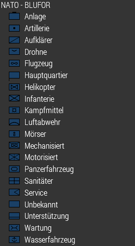
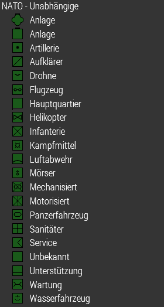
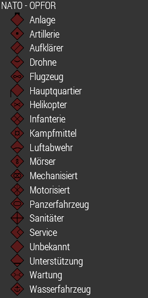
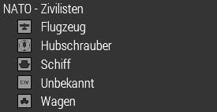
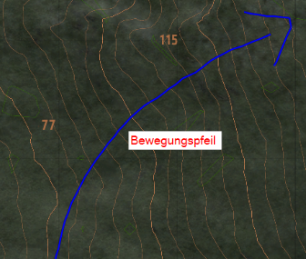
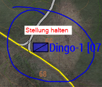
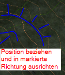

# 📒 Leitfaden / Handbuch

Hier findest du alle Notwendigen Vorgehensweisen, Vorgaben und Informationen, die du kennen / können solltest.  

Obwohl wir versuchen, so wenig wie möglich mit Regeln um uns zu werfen, sind ein paar trotzdem notwendig.  
Wir bitten darum, dass du dich an diese hältst, denn sie dienen einem ordentlichen Spielablauf und sollen den Spielspaß aufrecht erhalten. [Zur Dienstvorschrift](/milsim/dienstvorschrift)

<hr></hr>

## 🗃️ Organisation

Hier findest du alle Informationen zu jeder organisatorischen Einheit.

### Trupps

Ein Trupp besteht aus 3-4 Soldaten.  
Er setzt sich aus einem Truppführer, seinem Vertreter und zwei Soldaten zusammen.  


**Beispiel Trupp:**

<table>
  <thead>
    <tr>
      <th>Squad Alpha</th>
      <th>Position 1</th>
      <th>Position 2</th>
      <th>Position 3</th>
      <th>Position 4</th>
    </tr>
  </thead>
  <tbody>
    <tr>
      <td><b>Aufgabe</b></td>
      <td>Truppführer (TF)</td>
      <td>Ass. Truppführer (ATF)</td>
      <td>Schütze</td>
      <td>Sanitäter</td>
    </tr>
    <tr>
      <td><b>Rufzeichen</b></td>
      <td>Alpha-1</td>
      <td>Alpha-2</td>
      <td>Alpha-3</td>
      <td>Alpha-4</td>
    </tr>
  </tbody>
</table>

:::info
Position 2, 3 und 4 können auch Aufgaben wie MG-Schütze, AT-Schütze oder andere übernehmen.
:::

:::caution Hinweis
- Position 2 ist unabhängig von seiner Aufgabe (MG,AT ...) immer der assistierende Truppführer (ATF). 
- Sanitäter sind **immer** in der letzten Position zuzuordnen.
:::

### Zugstruktur

Ein Zug setzt sich aus mehreren Trupps zusammen.  
In der Regel gibt es einen **Zugführer (ZF)** mit seinem **Zugtrupp (ZT)**. Der Zugtrupp koordiniert alle Trupps seines Zuges. 


### 🏛️ Gesamtstruktur

Der **Command** ist die oberste Instanz und ist jeder Einheit übergeordnet, dies gilt zu jeder Zeit. Der Command ist für die Koordination des gesamten Verbandes zuständig.  
Die ZFs, sowie alle Unterstützungstruppen und nicht zugeordnete Einheiten sind ihm direkt unterstellt, während TFs nur indirekt unterstellt sind.

```mermaid
graph TD;
    Command-->Zugtrupp-1;
    Command-->Zugtrupp-2;
    Command-->Unterstützungseinheiten;
    Command-->x(Nicht Zugeordnete);
    Zugtrupp-1-->Alpha;
    Zugtrupp-1--->Bravo;
    Zugtrupp-2-->Charlie;
    Zugtrupp-2--->Delta;

```

### 📣 Rufzeichen / Bezeichnungen

#### Einsatzleitung / Missionsleitung / Command
Wird **Command** genannt, immer. *Command* ist die Person die, die Mission leitet. *Command* ist die oberste Entscheidungsinstanz.  
  
#### Trupprufzeichen 
Die Trupprufzeichen beginnen bei Alpha, Bravo, Charlie usw.  
Wie die einzelnen Truppmitglieder nummeriert sind siehst du [hier](/milsim/leitfaden#trupps).  
  
<hr></hr>  

## 🔄️ Standarprozeduren

Hier werden Prozeduren erklärt, die nach gewissen Standards ablaufen sollen, um die Effizienz aller Beteiligten zu erhöhen.

### ⭕ Rundumsicherung

Bei einer Rundumsicherung wird jeder Bereich durch ein Truppmitglied gesichert, sodass eine 360° Sicherung entsteht.  
- Wird aufgebaut so bald Einheit stationär ist
- Wird selbständig **immer** aufgebaut mit Absprache untereinander
  
### 🚚 Ab- / Aufsetzen

Ab-/Aufsetzen erfolgt **immer erst nach Befehl** des Truppführers.  
Beim Aufsetzen gibt jeder im Truppfunk durch das er sitzt:  
``"Alpha-3, sitzt."``  
So weiß der Truppführer, dass der Trupp abfahrt bereit ist und niemand vergessen wird.

### 🆘 Verwundeten Rettung

Wird ein Verwundeter gesichtet, muss dies sofort im Truppfunk gemeldet werden.  
``"Verwundeter, beim blauen Haus EG am Eingang!"``  
<br></br>

**Vorgehen:**
1. Anschließend (wenn nicht durch TF organisiert) mit einem TM organisieren und Sicherung des Verwundeten vorbereiten, z.B. einer gibt Feuerschutz der andere rückt vor zum Verwundeten und sichert die Umgebung. 
2. Der andere rückt nach.
3. Einer gibt Deckung, der andere untersucht den Verwundeten und führt Erst-Versorgung durch.
4. Verwundeten bergen, oder Sani zur Position rufen und weiter Deckung geben.


<hr></hr>

## 🗺️ Kartenpunkte  

### 🚩 Positionen 
Werden mit **Zulu** gekennzeichnet.  
Wird hinten nummeriert, also: Zulu-1, Zulu-2, Zulu-3 usw.  
  
Es ist auch möglich sein **Trupprufzeichen** hinzuzufügen, damit klar ist, dass ein Punkt nur für einen Trupp vorgesehen ist. (Auch sinnvoll, wenn es Wegmarker sind und die Trupps unterschiedliche Wege gehen, somit stimmt die Nummerierung der Punkte noch.)  
Beispiel: **Zulu-Alpha-1, Zulu-Alpha-2, Zulu-Bravo-1**

#### Spezielle Positionen
- Zulu-LP1 (Landezonen: Für Helis usw.)
- Zulu-DZ1 (Dropzone / Abwurfzone: Für Nachschubabwürfe usw.)
- Zulu-RP1 (Rückzugspunkt: Gesicherter Punkt für den Rückzug)
- Zulu-PI1 (Point of Interest: Punkt von Interesse)
- Zulu-SP1 (Scout Punkt: Punkt mit guter Einsicht auf das Ziel)

### ⚡ NATO-Symbole
Diese Symbole sind zum Markieren von Einheiten jeglicher Art.
Die Form des Rechtecks gibt Auskunft über die Seite der Einheit und auch die Farbe der Einheit.  
  
:::info Hinweis
Wie genau diese Marker auf der Karte angelegt werden sollen erfährst du im Taktik Bereich!
:::

````
Blau -> Eigene  
Grün -> Unabhängige  
Rot  -> Feinde  
Lila -> Zivile 
````

#### 🔵 BLUFOR



#### 🟢 INDIFOR


#### 🔴 OPFOR


#### 🟣 ZIVIL


<hr></hr>

## 🛡️ Taktik [WIP]
Taktik ist elementarer Bestandteil unserer Missionen und Grundlage für einen erfolgreichen Abschluss der Einsätze.  

### 📑 Taktische Planung
Auch wenn ein Plan meist nur teilweise durchgeführt wird, da er durch verschiedenste Faktoren zunichte geht.

Der 'Plan' sollte immer so detailliert wie möglich auf der Karte eingezeichnet werden, sodass jeder nachvollziehen kann, wie die nächsten Schritte sind.

**Beispiel für eine taktische Planung:**

Oben im Bild ist ein Angriff auf vorher aufgeklärte Feindeinheiten geplant.  
In den weißen Boxen sind Erklärungen anliegenden taktischen Zeichnungen.

#### Bewegungspfeil
Der Bewegungspfeil drückt aus, dass sich die Einheit, die am Anfang des Pfeils ist auf dem Pfeil bis zur Spitze bewegen soll.  
  
Der Bewegungspfeil kann auch zwischen zwei Punkten wie Zulu-1 und Zulu-2 sein, um anzuzeigen wie sich die von dem einen Punkt zum anderen bewegt werden soll.

#### Stellung halten
Wird mit einem Kreis markiert, der gleichzeitig eine Rundumsicherung symbolisiert.  
  
'Stellung halten' kann auch an einen Bewegungspfeil angeknüpft werden.

#### Position beziehen
Wird mit einem Halbkreis (oder kleiner/größer), der abstehende Striche hat, gekennzeichnet.  
   
Die abstehenden Striche zeigen Richtung Feind, dementsprechend soll sich das Hauptaugenmerk des Trupps dorthin richten.

### ❓ Planänderung
Eine Planänderung ist meistens erforderlich. Das liegt nicht an schlechten Plänen, sondern am begrenzten Wissen.  
Wenn man einen Plan ändert, sollte dies mit allen Truppführern und Command abgesprochen werden.  
Ebenfalls ist es wichtig, alles auf der Karte einzuzeichnen.


<hr></hr>

## 🩹 Erst Versorgung

Mit der erst Versorgung kann man sich oder andere stabilisieren, bis ein Sanitäter zur weiteren Versorgung vor Ort ist.  
Das Diagramm zeigt das Vorgehen bei Verletzten (sieht kompliziert aus, ist es aber nicht): 

```mermaid
graph TD;
  rM(Verletzung)-->rg;
  rM(Verletzung)-->rT;
  rg(Verletzte Gliedmaßen)-->rt(Tourniquets anlegen);
  rT(Verletzter Torso/Kopf)-->rV(Verband anlegen);
  rt-->rP(Puls prüfen);
  rV-->rP;
  rP-->rKP(Kein Puls);
  rP-->rMP(Hat Puls);
  rKP-->rA(Sofort Alamierung, lebensgefahr);
  rMP-->rAP(Atmung prüfen);
  rAP-->rKA(Keine Atmung);
  rAP-->rHA(Atmet);
  rHA-->rSS(Stabile Seitenlage);
  rKA-->rKU(Kopf überstrecken und drehen);
  rKU-->rSA(Sofort Alamierung, lebensgefahr);
  rSA-->rMAuD(Hilfe anfordern und Sicherung aufbauen);
  rSS-->rMAuD;
  rA-->rMAuD;
```




<hr></hr>

## 🔥 Feuerstatus

>### 🟢 Grün
>Feuer auf **bestätigte** feindliche Einheiten darf nach eigenem Ermessen >eröffnet werden.

>### 🟡 Gelb
>Beschuss erwidern

>### 🔴 Rot
>Feuer auf **bestätigte** feindliche Einheiten darf nach eigenem Ermessen >eröffnet werden.

:::caution Wichtig
Im Nahbereich ist der Feuerstatus nicht von Relevanz.
Selbstverteidigung ist hier das oberste Gebot.
:::

<hr></hr>

## 🔭 Kontakt

Die **EÜMPF-Regel (Erfassen, Überprüfen, Melden, Positionieren, Feuerstatus)**:

1. **Erfassen** der notwendigen Informationen: Richtung, Menge, Geländemarker (rotes Haus, blaues Auto ...)
2. **Überprüfen** (falls möglich)  welche Art von Kontakt: **Feind, Freund, Zivil, Unbekannt**
3. 📟 **Melden**:  
**"Kontakt, [Menge und Typ], [Richtung] [Distanz] [evtl. Geländemerkmal]"**  
[Zum Funk-Handbuch](/milsim/funk-handbuch#kontaktmeldung)  
Beispiel:   
"Kontakt, 206°, 5 Bewaffnete, Unbekannt"  
"Kontakt, Voraus, 2 Fahrzeuge, Feindlich"
4. **Positionieren**: Insbesondere bei Feindkontakt, z.B. Deckung suchen
5. **Feuerstatus**: Beachten und dementsprechend handeln

:::tip Tipp
Wenn es sich um scheinbaren Feindkontakt handelt, kann es sinnvoll sein Deckung zu suchen und dann eine Meldung zu machen, da man nichts melden kann wenn man bewusstlos ist. 😉
:::

<hr></hr>

## ⌚ Missionsablauf

1. 🏴 Sammeln auf dem Server
2. 🗣️ Briefing (Vorstellung der Mission und Besprechen des Vorgehens)
3. 🙋🏻 Einteilen der Trupps
4. 🔄️ Organisieren der Trupps (Aufgaben / Rollen zuteilen)
5. 🎒 Ausrüsten ([MBC abarbeiten](/milsim/leitfaden#-missions-bereitschafts-checkliste-mbc))
6. 🚚 Zum Einsatzort
7. ⚡ Mission wird durchgeführt
8. 🚁 Zurück zur Basis
9. ✍🏻 Nachbesprechung / Debriefing (Wie lief der Einsatz, Verbesserungsvorschläge ...)

<hr></hr>

## 📋 Missions Bereitschafts Checkliste (MBC)

Die MBC dient als routinierter Ablauf zur Vorbereitung auf eine anstehende Mission.  
Die Durchführung der MBC findet i.d.R. nach der Festlegung der Trupps und Einteilung der Spieler statt.

### 1. Ausrüstung

Die richtige Ausrüstung ist der wichtigste Teil der MBC.  
Abhängig ist die Ausrüstung von:
- **[Ausrüstungsvorgaben](/milsim/ausruestung)** 
- Einsatzgelände (Tarnung)
- Aufgabe im Trupp (MG, AT, Medic ...)
- Vorgaben aus dem Briefing
- Vorgaben des Truppführers

### 2. Funk

Ein korrekt konfiguriertes Funkgerät ist ebenso wichtig wie die passende Ausrüstung.  
Geprüft werden muss:
- Richtiges Funkgerät
- Richtiger Kanal
- Funktionsfähigkeit (*der Funkcheck*)
- **[Das Funk-Handbuch](/milsim/funk-handbuch)** 

### 3. Aufgabe / Mission / Vorgehen

Auch als normales Truppmitglied ist es von Vorteil die Aufgabe, grobe Mission und das ungefähre Vorgehen zu kennen.  
Das hilft z.B. Verwirrung vorzubeugen.  
- Schau auf die Karte, dort wird das Vorgehen und die Ziele markiert und beschriftet.
- Frag deinen Truppführer bei Unklarheiten

### 4. Vorbereitung

Nach dem du dich persönlich vorbereitet hast, melde dich bei deinem Truppführer.
Es gibt fast immer Dinge, die noch Vorbereitet werden müssen, wie z.B. das Fahrzeug beladen oder das Fahrzeug bereitstellen.