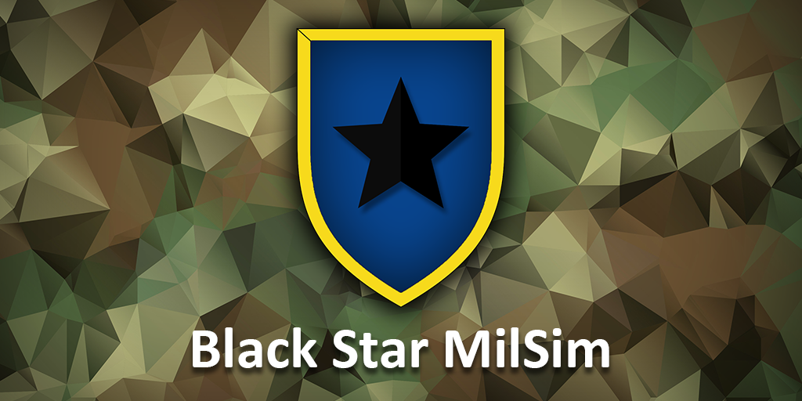
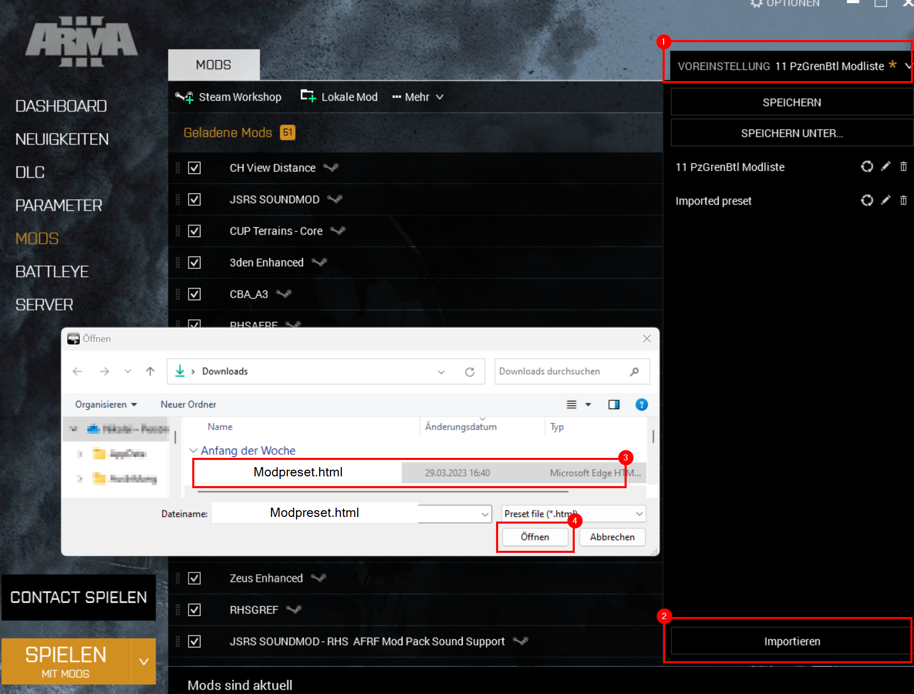

# 🪖 Hauptseite

Hier findest du alle Informationen zu unserem MilSim Projekt.  

---

## 📌 Quick Links

**[📒 Leitfaden](/milsim/leitfaden)**

**[🎒 Ausrüstungsvorgaben](/milsim/ausruestung)**

**[❓ Wie werde Ich Mitglied?](/milsim/mitglied_werden)**

**[📚 Ausbildungen](/milsim/ausbildungen/Uebersicht)**

**[📟 Funk-Handbuch](/milsim/funk-handbuch)**

---

## 🙋🏻 Ansprechpartner

<table>
  <thead>
    <tr>
      <th>Ansprechpartner</th>
      <th>Bereich</th>
    </tr>
  </thead>
  <tbody>
    <tr>
      <td>ThePhoenix</td>
      <td>Alles</td>
    </tr>
    <tr>
      <td><b>Mage</b></td>
      <td>Luftwaffe, UAV</td>
    </tr>
  </tbody>
</table>

---

## 🪛 Modset

:::info
**Du hast die Wahl: **
Du kannst die Workshop Kollektion herunterladen, oder direkt das Mod Preset im Launcher hinzufügen.
Beides Startet den Download der Mods.
:::

### ⬇️ Downloads

#### 🪨 Standard Preset
Das Mod Preset für den Launcher findest du hier:  
**<a target="_blank" href={ require("/downloads/BlackStarMilSimModliste.zip").default } download>Download</a> ** 

#### 🧪 BETA Preset
Das Beta Mod Preset für den Launcher findest du hier:  
**<a target="_blank" href={ require("/downloads/BlackStarMilSimModliste2.zip").default } download>Download</a> ** 

:::tip Hinweis
Ihr müsst die Zip-Datei öffnen, darin ist die HTML-Datei die ihr braucht.
:::

---

### ➕ Preset zum Launcher hinzufügen

Lade das Preset runter und starte den Arma Launcher.

- Klicke rechts oben auf `Voreinstellung`
- Klicke rechts unten auf `Importieren`
- Wähle dann im Dialogfeld die heruntergeladene Datei aus

